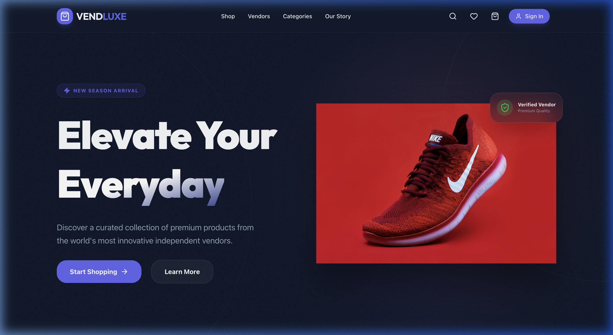
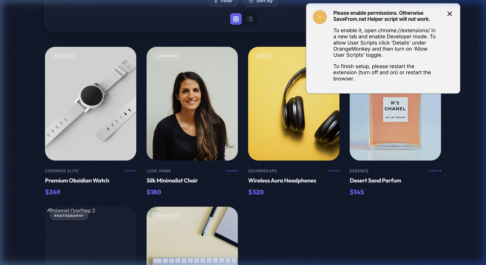
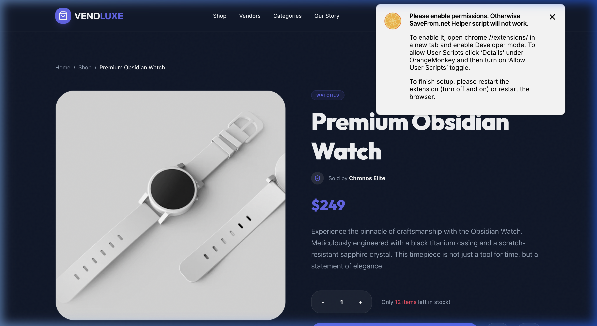
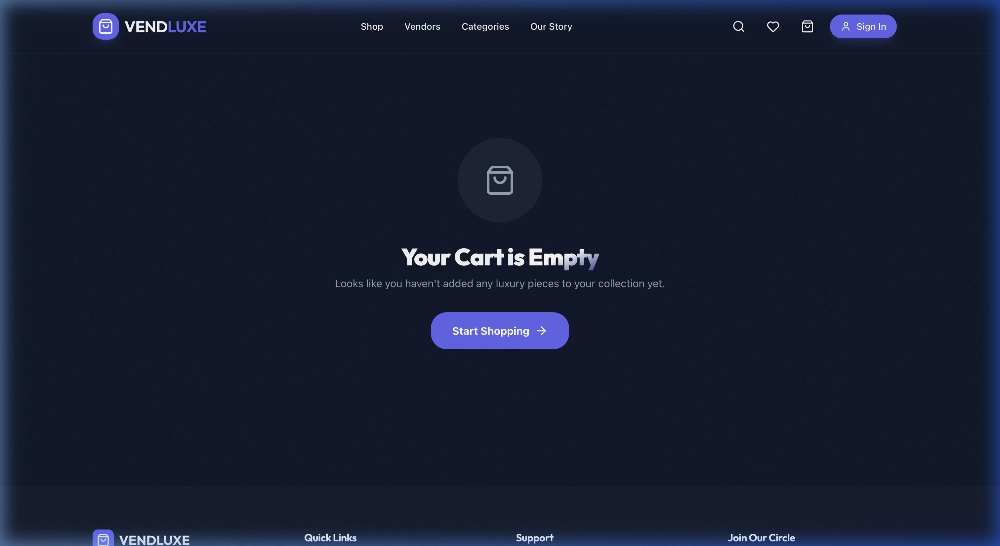
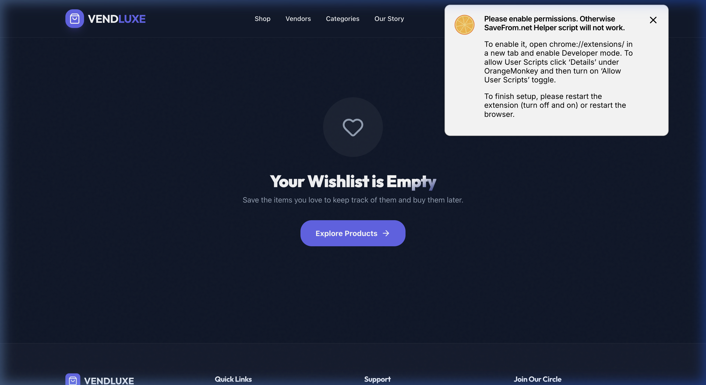
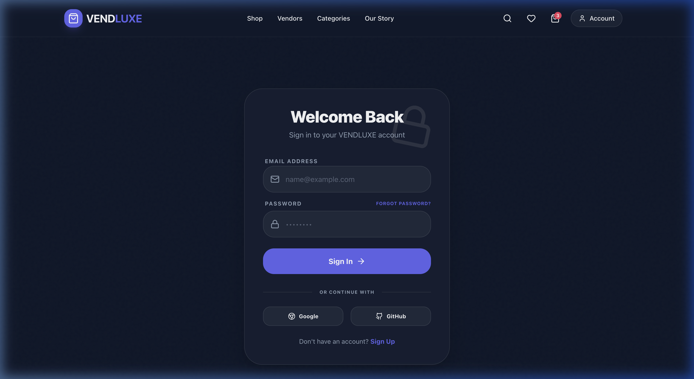

# VendLuxe - Premium Multi-Vendor Ecommerce

VendLuxe is a state-of-the-art, high-performance multi-vendor ecommerce platform built with the PERN stack (PostgreSQL, Express, React, Node.js). It features a modern, luxury-inspired UI/UX with glassmorphism, smooth animations, and a robust functional core.

## ✨ Features

- **Luxury Design System**: Built with Tailwind 4 and Framer Motion for a premium look and feel.
- **Role-Based Authentication**: Separate flows for Customers and Vendors.
- **Advanced Product Discovery**: Real-time search with debouncing, category filtering, and responsive grid/list views.
- **Functional E-commerce Core**: Integrated Cart, Wishlist, and Product Detail systems.
- **RTK Query Integration**: Standardized data fetching and state management for optimal performance.
- **SEO Optimized**: Pre-configured meta tags and semantic HTML structure.

## 📸 Screenshots

### 🏠 Home Page
*The high-impact hero section with smooth entrance animations.*


### 🛒 Shop & Search
*Advanced product repository with real-time filtering and search.*


### 🔍 Product Details
*Deep-dive into product specifics with dynamic image galleries.*


### 🛍️ Shopping Experience
*Premium Cart and Wishlist management.*



### 🔐 Authentication
*Modern, secure login and registration interfaces.*


## 🛠️ Technology Stack

- **Frontend**: React 19, TypeScript, Vite
- **Styling**: Tailwind CSS 4, Framer Motion (Animations), Lucide React (Icons)
- **State Management**: Redux Toolkit (RTK Query)
- **API**: Axios, RESTful Endpoints
- **Tools**: React Router v7, React Toastify, Zod

## 🚀 Getting Started

### Prerequisites
- Node.js (v18+)
- Backend API server running (see backend repository)

### Installation

1. Clone the repository:
   ```bash
   git clone https://github.com/okoye-peter/multi-vendor-ecommerce-app.git
   cd multi-vendor-ecommerce-app/frontend
   ```

2. Install dependencies:
   ```bash
   npm install
   ```

3. Configure Environment Variables:
   Create a `.env` file based on `.env.example`:
   ```env
   VITE_API_URL=http://localhost:5004/api/v1
   ```

4. Run the development server:
   ```bash
   npm run dev
   ```

## 🤝 Contributing
Contributions are welcome! Please feel free to submit a Pull Request.

## 📄 License
This project is licensed under the MIT License.
